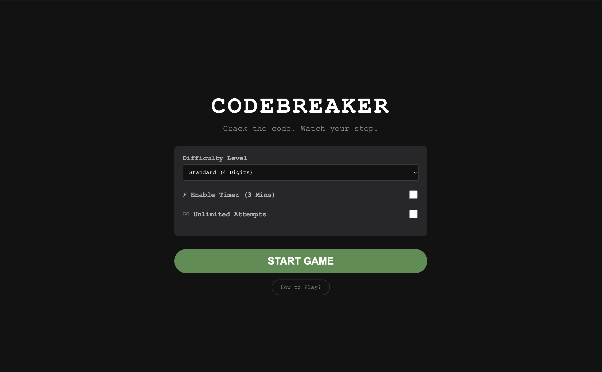
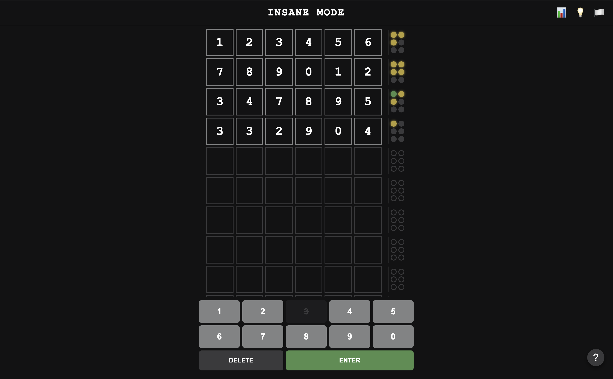
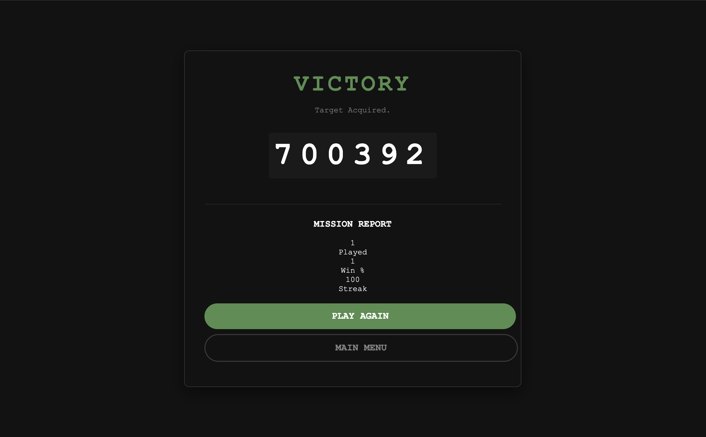

<div align="center">

# 🕵️‍♂️ CODEBREAKER
**The Ultimate Logic Deduction Protocol**


[**PLAY THE GAME LIVE**](https://codebreaker-pqmi.onrender.com)


</div>

---

## 🧐 What is CodeBreaker?

**CodeBreaker** is a modern, high-fidelity web adaptation of the classic pen-and-paper game *Cows and Bulls* (the predecessor to Mastermind).

Unlike simple guessing games, CodeBreaker is a test of pure logic. The goal is to crack a secret numeric code by interpreting feedback from your previous guesses. It features a hacker-inspired dark UI, advanced game modes, and a "Detective" toolset to help you deduce the answer.

---

## ✨ Features

### 🎮 Gameplay Modes
The game scales from casual practice to impossible logic puzzles.

| Difficulty | Length | Repeats? | Attempts | Description |
|:--- | :---: | :---: | :---: | :--- |
| **Rookie** | 3 | ❌ | 10 | The perfect warm-up. |
| **Standard** | 4 | ❌ | 10 | The classic experience. |
| **Expert** | 5 | ❌ | 12 | For seasoned logicians. |
| **Master** | 4 | **✅** | 12 | Repeats allowed. Standard logic fails here. |
| **INSANE** | 6 | **✅** | 15 | The ultimate challenge. Good luck. |

### ⚙️ Modifiers
* **⚡ Rush Mode (Timer):** A 3-minute countdown to ramp up the pressure.
* **♾️ Infinity Mode:** Removes the attempt limit and enables an **infinite scrolling grid** that generates new rows as you play.

### 🛠️ The Detective Toolset
* **Smart Notepad:** Right-click (PC) or Long-Press (Mobile) any number on the keypad to **cross it out**. This visual aid is crucial for elimination logic.
* **Hint System:** Stuck? Request a hint to reveal one correct digit (Limited to 2 per game).
* **Stat Tracking:** Persistent local storage tracks your Games Played, Win %, and Current Streak.

---

## 🧠 How to Play

The computer generates a secret code. You make a guess, and the system gives you feedback using colored dots:

* **🟢 BULL (Green Dot):** Correct Number, Correct Position.
* **🟡 COW (Yellow Dot):** Correct Number, Wrong Position.
* **⚫ GRAY (Empty Dot):** That number does not exist in the code.

> **⚠️ CRITICAL RULE:** The order of the dots is randomized. It does **not** correspond to the order of the numbers! You must use logic to figure out which number triggered which dot.

---

## 📸 Screenshots

| Splash Screen | Gameplay (Insane) | Victory Screen |
|:---:|:---:|:---:|
| " |  |  |


---

## 🏗️ Architecture & Tech Stack

This project uses a **Decoupled Architecture** for stability.

* **Backend (Python/Flask):** Handles the secret code generation, validation logic, and session management. The secret code is never sent to the client until the game ends, preventing cheating via "Inspect Element."
* **Frontend (HTML/JS):** * **Golden Master Script:** A single, robust JavaScript engine handles all game logic, timers, and UI updates across all difficulty levels.
    * **Responsive Design:** Uses `100dvh` and Flexbox to provide a native-app feel on mobile devices while maintaining a desktop-first precision experience.
* **Visuals:** Custom CSS animations (Shake effects), Canvas Confetti, and a responsive layout that handles "Safe Areas" on modern smartphones.

---

## 🚀 Local Installation

Want to run the logic engine on your own machine?

1.  **Clone the Repo:**
    ```bash
    git clone https://github.com/CaSh007s/codebreaker.git
    cd codebreaker
    ```

2.  **Create Environment:**
    ```bash
    # Windows
    python -m venv venv
    venv\Scripts\activate

    # Mac/Linux
    python3 -m venv venv
    source venv/bin/activate
    ```

3.  **Install Dependencies:**
    ```bash
    pip install -r requirements.txt
    ```

4.  **Run the Server:**
    ```bash
    python app.py
    ```
    Access the game at `http://127.0.0.1:5000`.

---

## 📄 License

Distributed under the MIT License. See `LICENSE` for more information.

---

<p align="center">
  Made with ❤️ and Logic
</p>
