<div align="center">
  <h1>Codebreaker</h1>
  <p style="font-size: 1.2rem; color: #888;"><strong>Precision Logic. Tactical Superiority.</strong></p>

  <!-- Screenshots Preview -->
  <div style="display: flex; flex-direction: column; gap: 20px; align-items: center; margin-top: 30px;">
    <div style="width: 100%; max-width: 850px; border-radius: 16px; overflow: hidden; border: 1px solid #333; box-shadow: 0 20px 50px rgba(0,0,0,0.6);">
      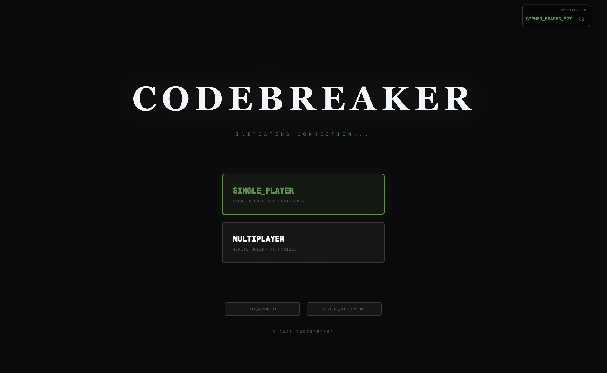
    </div>
  </div>

  <br />

  <div style="display: flex; gap: 12px; justify-content: center; margin-top: 20px;">
    
    
    
    
  </div>
</div>

<hr style="border: 0; border-top: 1px solid #222; margin: 50px 0;" />

## 🎯 Executive Overview

Codebreaker is a high-stakes, tactical logic engine designed for intellectuals who thrive under pressure. It reimagines the classic Mastermind (Cows & Bulls) mechanic within a modern, military-grade interface. 

Engineered for performance and real-time competition, the platform orchestrates complex game states across a distributed architecture, ensuring millisecond-precision feedback. Whether engaging in classified single-player missions or escalating to global multiplayer operations, Codebreaker delivers a premium, immersive experience where every guess is a strategic maneuver.

<hr style="border: 0; border-top: 1px solid #222; margin: 40px 0;" />

## 🛠️ Technical Infrastructure

| Layer | Technologies | Role |
| :--- | :--- | :--- |
| **Frontend** | React 19, Next.js 15, TypeScript | Core application logic and responsive UI |
| **Styling** | Tailwind CSS 4, Framer Motion | Design system and micro-animations |
| **Backend** | FastAPI, Python 3.11+ | Asynchronous service architecture |
| **Real-time** | Socket.IO, WebSockets | Bi-directional game state synchronization |
| **State/Storage**| Redis, Zustand, TanStack Query | Persistence and local state management |
| **Security** | Slowapi, Pydantic v2 | Rate limiting and robust data validation |

<hr style="border: 0; border-top: 1px solid #222; margin: 40px 0;" />

## 🚀 Key Features

<div style="display: grid; grid-template-columns: repeat(2, 1fr); gap: 20px; margin-top: 20px;">
  <!-- Feature 1: Missions -->
  <div style="background: #111; padding: 25px; border-radius: 12px; border: 1px solid #222; box-shadow: 0 4px 15px rgba(0,0,0,0.3);">
    <div style="display: flex; align-items: center; gap: 15px; margin-bottom: 15px;">
      <span style="background: #1a1a1a; padding: 10px; border-radius: 8px; border: 1px solid #333; font-size: 1.5rem; display: flex; align-items: center; justify-content: center;">🎮</span>
      <h3 style="margin: 0; color: #fff;">Classified Missions</h3>
    </div>
    <ul style="color: #999; line-height: 1.6; padding-left: 20px;">
      <li>Progressive single-player campaign with adaptive difficulty.</li>
      <li>Dynamic code lengths and limited survival attempts.</li>
      <li>Strategic level constraints designed to test analytical edge.</li>
    </ul>
  </div>

  <!-- Feature 2: Multiplayer -->
  <div style="background: #111; padding: 25px; border-radius: 12px; border: 1px solid #222; box-shadow: 0 4px 15px rgba(0,0,0,0.3);">
    <div style="display: flex; align-items: center; gap: 15px; margin-bottom: 15px;">
      <span style="background: #1a1a1a; padding: 10px; border-radius: 8px; border: 1px solid #333; font-size: 1.5rem; display: flex; align-items: center; justify-content: center;">⚔️</span>
      <h3 style="margin: 0; color: #fff;">Live Operations</h3>
    </div>
    <ul style="color: #999; line-height: 1.6; padding-left: 20px;">
      <li>Real-time head-to-head combat via global matchmaking.</li>
      <li>Low-latency Socket.IO bridge for instantaneous synchronization.</li>
      <li>Live opponent tracking to monitor competitive maneuvers.</li>
    </ul>
  </div>

  <!-- Feature 3: Analytics -->
  <div style="background: #111; padding: 25px; border-radius: 12px; border: 1px solid #222; box-shadow: 0 4px 15px rgba(0,0,0,0.3);">
    <div style="display: flex; align-items: center; gap: 15px; margin-bottom: 15px;">
      <span style="background: #1a1a1a; padding: 10px; border-radius: 8px; border: 1px solid #333; font-size: 1.5rem; display: flex; align-items: center; justify-content: center;">📊</span>
      <h3 style="margin: 0; color: #fff;">Tactical Analytics</h3>
    </div>
    <ul style="color: #999; line-height: 1.6; padding-left: 20px;">
      <li>Instantaneous hit/miss calculations and visual guidance.</li>
      <li>Persistent mission history via an interactive grid system.</li>
      <li>Real-time clue distribution for rapid strategic pivots.</li>
    </ul>
  </div>

  <!-- Feature 4: UI/UX -->
  <div style="background: #111; padding: 25px; border-radius: 12px; border: 1px solid #222; box-shadow: 0 4px 15px rgba(0,0,0,0.3);">
    <div style="display: flex; align-items: center; gap: 15px; margin-bottom: 15px;">
      <span style="background: #1a1a1a; padding: 10px; border-radius: 8px; border: 1px solid #333; font-size: 1.5rem; display: flex; align-items: center; justify-content: center;">✨</span>
      <h3 style="margin: 0; color: #fff;">Premium UI Engine</h3>
    </div>
    <ul style="color: #999; line-height: 1.6; padding-left: 20px;">
      <li>High-fidelity "Commando" theme with dark-mode optimization.</li>
      <li>Fluid Framer Motion transitions and micro-animations.</li>
      <li>Immersive tactical interface built for precision interaction.</li>
    </ul>
  </div>
</div>

<hr style="border: 0; border-top: 1px solid #222; margin: 50px 0;" />

## 🖼️ System Gallery

<div style="max-width: 900px; margin: 0 auto;">

### 💻 Desktop Operations

<table width="100%" style="border-collapse: collapse; border: 1px solid #333;">
  <tr>
    <td align="center" width="50%" style="border: 1px solid #333; padding: 25px;">
      <h3 style="margin: 0; color: #fff;">System Initialization</h3>
      <p style="color: #888; margin: 10px 0 20px 0;">Secure authentication and logic system decryption protocol.</p>
      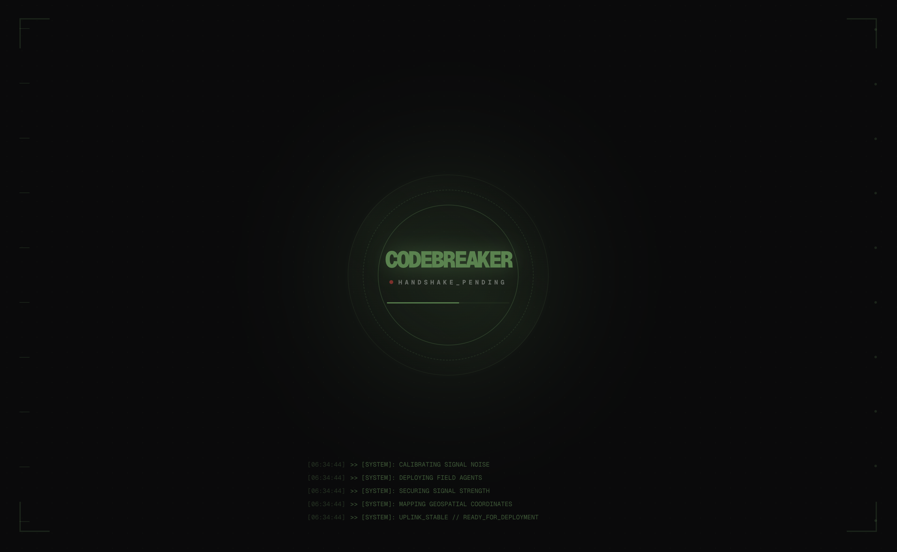
    </td>
    <td align="center" width="50%" style="border: 1px solid #333; padding: 25px;">
      <h3 style="margin: 0; color: #fff;">Intelligence Briefing</h3>
      <p style="color: #888; margin: 10px 0 20px 0;">Comprehensive operational guide for tactical logic specialists.</p>
      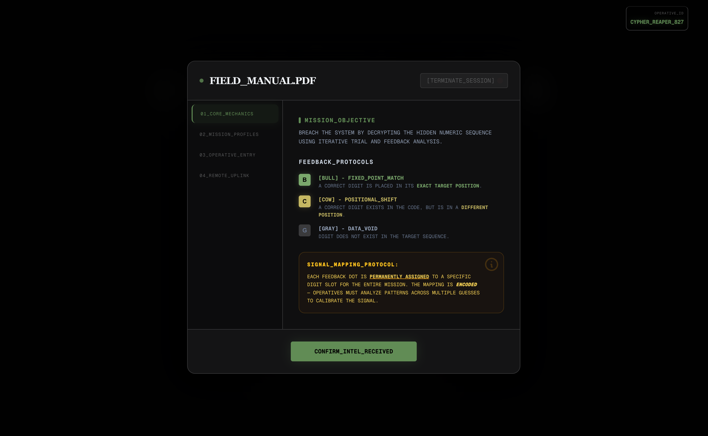
    </td>
  </tr>
  <tr>
    <td align="center" width="50%" style="border: 1px solid #333; padding: 25px;">
      <h3 style="margin: 0; color: #fff;">Global Operative Rankings</h3>
      <p style="color: #888; margin: 10px 0 20px 0;">Top-tier operative performance metrics and strategic superiority.</p>
      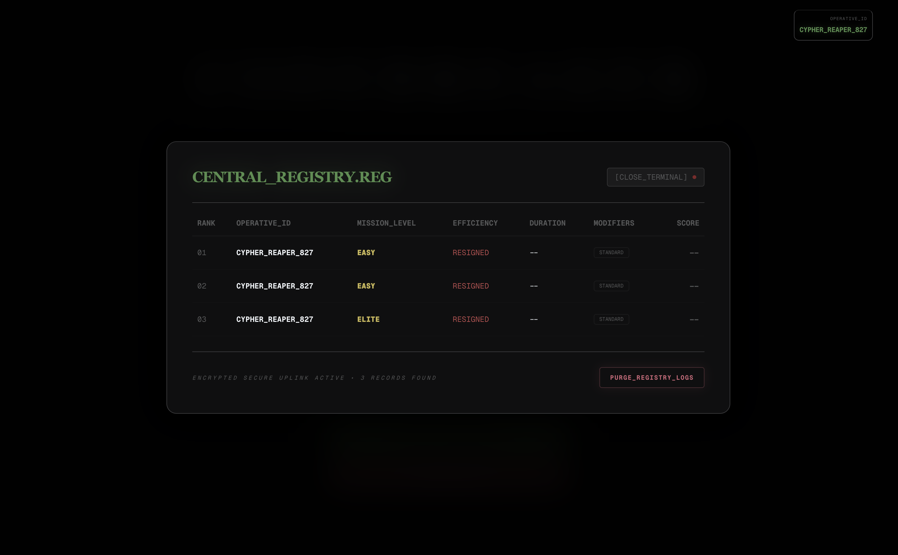
    </td>
    <td align="center" width="50%" style="border: 1px solid #333; padding: 25px;">
      <h3 style="margin: 0; color: #fff;">Tactical Communications</h3>
      <p style="color: #888; margin: 10px 0 20px 0;">Real-time head-to-head communication with mission-critical status updates.</p>
      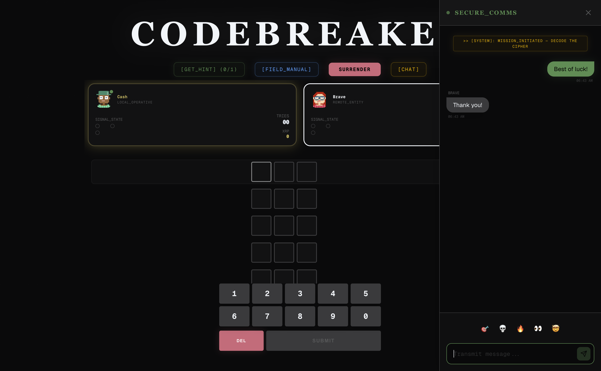
    </td>
  </tr>
  <tr>
    <td align="center" width="50%" style="border: 1px solid #333; padding: 25px;">
      <h3 style="margin: 0; color: #fff;">Live Operations Theater</h3>
      <p style="color: #888; margin: 10px 0 20px 0;">Regional matchmaking for active high-stakes logic engagements.</p>
      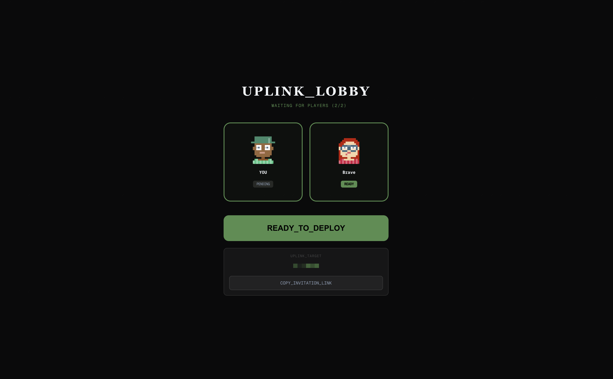
    </td>
    <td align="center" width="50%" style="border: 1px solid #333; padding: 25px;">
      <h3 style="margin: 0; color: #fff;">Classified Mission Ops</h3>
      <p style="color: #888; margin: 10px 0 20px 0;">Single-player campaign operations with adaptive logical constraints.</p>
      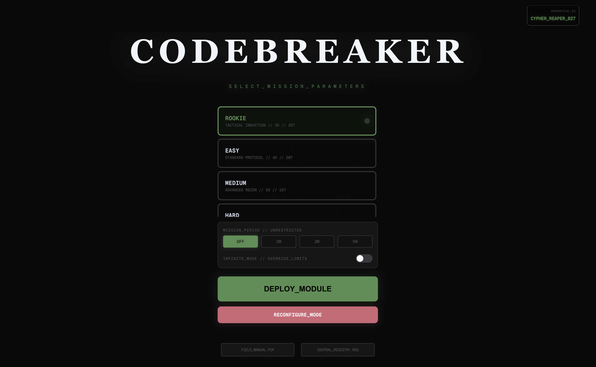
    </td>
  </tr>
  <tr>
    <td align="center" width="50%" style="border: 1px solid #333; padding: 25px;">
      <h3 style="margin: 0; color: #fff;">Operational Success</h3>
      <p style="color: #888; margin: 10px 0 20px 0;">Verification of objective completion and logic system mastery.</p>
      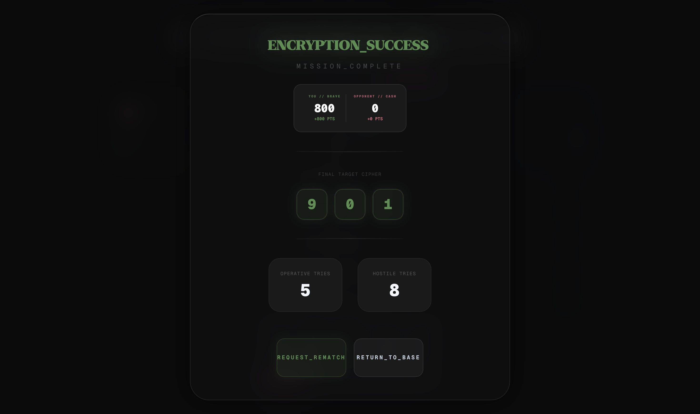
    </td>
    <td align="center" width="50%" style="border: 1px solid #333; padding: 25px;">
      <h3 style="margin: 0; color: #fff;">Critical System Failure</h3>
      <p style="color: #888; margin: 10px 0 20px 0;">Post-operational review of compromised logic states.</p>
      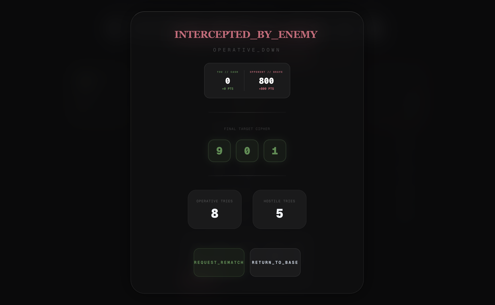
    </td>
  </tr>
</table>

### 📱 Mobile Reconnaissance

<table width="100%" style="border-collapse: collapse; border: 1px solid #333;">
  <tr>
    <td align="center" width="50%" style="border: 1px solid #333; padding: 25px;">
      <h3 style="margin: 0; color: #fff;">Mobile Tactical Interface</h3>
      <p style="color: #888; margin: 10px 0 20px 0;">High-fidelity field operations for logic agents on mobile devices.</p>
      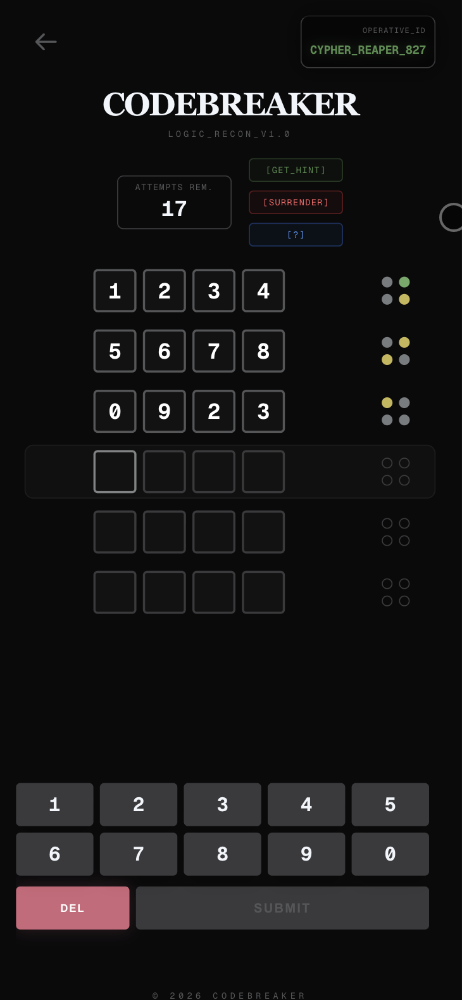
    </td>
    <td align="center" width="50%" style="border: 1px solid #333; padding: 25px;">
      <h3 style="margin: 0; color: #fff;">Overdrive Protocol Selection</h3>
      <p style="color: #888; margin: 10px 0 20px 0;">Selection of high-intensity mission profiles in maximum stress mode.</p>
      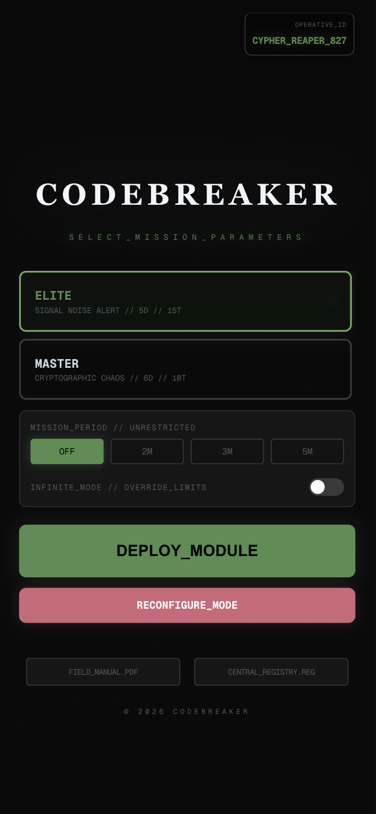
    </td>
  </tr>
  <tr>
    <td align="center" width="50%" style="border: 1px solid #333; padding: 25px;">
      <h3 style="margin: 0; color: #fff;">Operational Degradation</h3>
      <p style="color: #888; margin: 10px 0 20px 0;">Real-time alert for compromised multiplayer mission parameters.</p>
      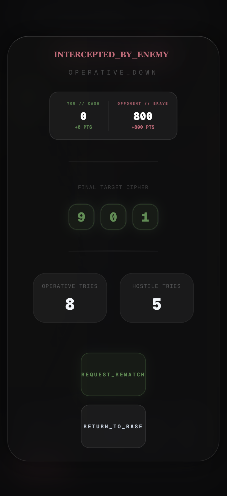
    </td>
    <td align="center" width="50%" style="border: 1px solid #333; padding: 25px;">
      <h3 style="margin: 0; color: #fff;">Strategic Withdrawal</h3>
      <p style="color: #888; margin: 10px 0 20px 0;">Formal termination of an active field operation.</p>
      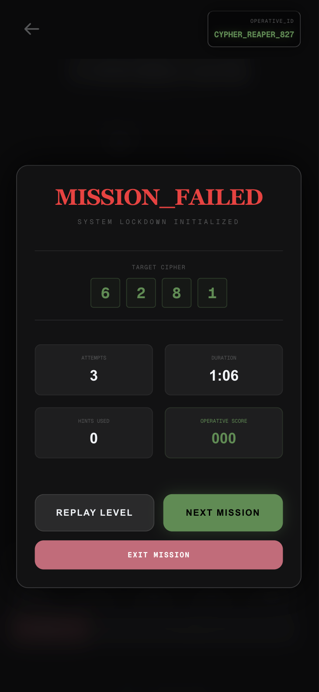
    </td>
  </tr>
</table>

</div>

<hr style="border: 0; border-top: 1px solid #222; margin: 50px 0;" />

## ⚙️ Deployment Protocol

### 1. Intelligence Service (Backend)
```bash
cd backend
python -m venv .venv
source .venv/bin/activate
pip install -r requirements.txt
python main.py
```

### 2. Field Interface (Frontend)
```bash
cd frontend
pnpm install
pnpm dev
```

### 3. Requirements
- **Redis**: Mandatory for multiplayer session handling.
- **Node.js 20+** & **Python 3.11+**

<hr style="border: 0; border-top: 1px solid #222; margin: 60px 0;" />

<div align="center">
  <p style="color: #555; font-size: 0.8rem;">© 2026 Kalash Pratap Gaur. All Rights Reserved.</p>
</div>
